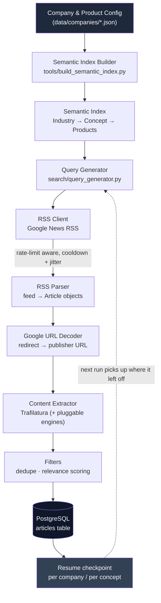
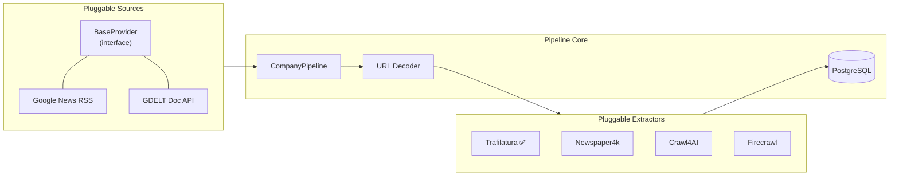

<div align="center">

# 📡 Semantic News Scraper

**A resumable, semantics-driven news intelligence pipeline.**
Turns a company × product × industry taxonomy into targeted search queries, harvests fresh coverage from Google News RSS, resolves and extracts full article text, and lands clean, deduplicated records in PostgreSQL - ready for downstream lead-generation and market-signal analysis.


</div>

---

## Why this exists

Turning "which companies are talking about X in the news" into a queryable dataset sounds simple until you actually try it: Google News RSS returns redirect-wrapped URLs, not the real article; every publisher's HTML is different; the same story gets syndicated across a dozen outlets; and any script that fires hundreds of queries in a loop gets rate-limited in minutes.

This project is my answer to that problem, built around a simple idea: **let a semantic taxonomy drive the search, not a flat keyword list.** Instead of searching "Bosch news," it searches `"Bosch" "Predictive Maintenance"`, `"Bosch" "Fraud Detection"`, etc. - one query per relevant concept, generated automatically from a company's product/industry mapping - so the articles that come back are actually relevant to a specific business signal, not just noise.

---

## How it flows



Every company run walks its industry's concept list one at a time, checkpoints its progress in Postgres after each concept, and can be killed and restarted without redoing work or re-saving duplicates.

---

## Architecture at a glance

The codebase is split into small, swappable layers rather than one monolithic script - the goal was to make it trivial to add a new news source or a new extraction engine without touching the pipeline logic.



| Layer         | Purpose                                                                                                                                | Status                                                         |
| ------------- | -------------------------------------------------------------------------------------------------------------------------------------- | -------------------------------------------------------------- |
| `providers/`  | Abstract source interface (`BaseProvider`) - Google News RSS is the primary path, GDELT is a secondary source for broader time windows | ✅ RSS · ✅ GDELT                                              |
| `extractors/` | Pulls clean article text out of arbitrary publisher HTML                                                                               | ✅ Trafilatura wired in · others scaffolded for future engines |
| `filters/`    | Deduplication and relevance scoring before a write hits the DB                                                                         | 🚧 in progress                                                 |
| `pipeline/`   | Orchestrates the full run per company, with resume/checkpoint logic and Google rate-limit backoff                                      | ✅                                                             |
| `database/`   | PostgreSQL persistence layer + schema                                                                                                  | ✅                                                             |
| `search/`     | Builds the industry → concept → product semantic index from a company's taxonomy and generates targeted queries from it                | ✅                                                             |

---

## What's under the hood

<table>
<tr><td valign="top" width="50%">

**Ingestion & parsing**

- `feedparser` - Google News RSS/Atom parsing
- `requests` - HTTP layer with custom UA + timeout handling
- `googlenewsdecoder` - resolves Google's redirect URLs to the real publisher link
- `gdeltdoc` - GDELT Doc API as a secondary source

**Extraction & cleaning**

- `trafilatura` - main-content extraction from raw HTML
- `newspaper4k` - alternate extraction engine (scaffolded)
- `beautifulsoup4` / `lxml` - HTML parsing utilities

</td><td valign="top" width="50%">

**Persistence**

- `psycopg2-binary` - PostgreSQL driver
- Resume-safe schema with a `UNIQUE` constraint on URL for free deduplication at the DB layer

**Ops & DX**

- `python-dotenv` - environment-based config, no secrets in code
- `loguru` - structured logging
- `tqdm` / `colorama` - progress + readable console output
- Randomized jitter + cooldown windows to stay under Google's rate limits

</td></tr>
</table>

---

## Project structure

```
semantic-news-scraper/
├── main.py                      # entry point - kick off a company run
├── config/
│   └── settings.py              # env-driven config (DB, timeouts, limits)
├── search/
│   ├── company_loader.py        # loads a company's semantic index
│   └── query_generator.py       # builds "Company" "Concept" search queries
├── tools/
│   └── build_semantic_index.py  # Industry → Concept → Products index builder
├── rss/
│   ├── rss_client.py            # Google News RSS client + rate-limit handling
│   └── rss_parser.py            # feed entries → Article objects
├── providers/
│   ├── base_provider.py         # abstract source interface
│   └── gdelt_provider.py        # GDELT Doc API source
├── news/
│   └── url_decoder.py           # Google redirect URL → real publisher URL
├── extractors/
│   └── trafilatura_extractor.py # HTML → clean article text
├── filters/                     # dedup + relevance scoring (in progress)
├── models/
│   └── article.py                # Article dataclass shared across the pipeline
├── database/
│   ├── postgres.py               # persistence layer
│   └── schema.sql                # articles table definition
├── pipeline/
│   └── company_pipeline.py       # orchestration, resume logic, backoff
├── data/
│   └── companies/                # per-company product/industry taxonomies
└── tests/                        # exploratory scripts against live sources
```

---

## Local setup

**1. Clone and create a virtual environment**

```bash
git clone https://github.com/<your-username>/semantic-news-scraper.git
cd semantic-news-scraper
python -m venv .venv
source .venv/bin/activate      # Windows: .venv\Scripts\activate
```

**2. Install dependencies**

```bash
pip install -r requirements.txt
```

**3. Set up PostgreSQL**

```bash
createdb lead_intelligence
psql -d lead_intelligence -f database/schema.sql
```

**4. Configure environment variables**

```bash
cp .env.example .env
# then edit .env with your local DB credentials
```

**5. Build the semantic index** (from a company taxonomy in `data/companies/`)

```bash
python tools/build_semantic_index.py
```

**6. Run the pipeline**

```bash
python main.py
```

---

## Example: how a query gets built

Given a taxonomy entry like:

```json
{
  "product_name": "Product X",
  "industry": "Financial Services",
  "semantics": ["Fraud Detection", "Payment Security", "AML"]
}
```

the pipeline generates one targeted RSS query per concept - `"<Company>" "Fraud Detection"`, `"<Company>" "Payment Security"`, `"<Company>" "AML"` - rather than one generic company-name search, so what comes back is filtered toward a specific business signal before a single line of article text is even fetched.

---

## Roadmap

- [ ] Finish relevance & duplicate filters (currently scaffolded, not wired into the pipeline)
- [ ] Add Newspaper4k / Crawl4AI / Firecrawl as selectable extraction backends
- [ ] Turn ad-hoc scripts in `tests/` into real automated tests
- [ ] Batch pipeline for running multiple companies concurrently
- [ ] Lightweight dashboard for reviewing captured signals

---

## License

MIT - see [LICENSE](LICENSE) for details.
